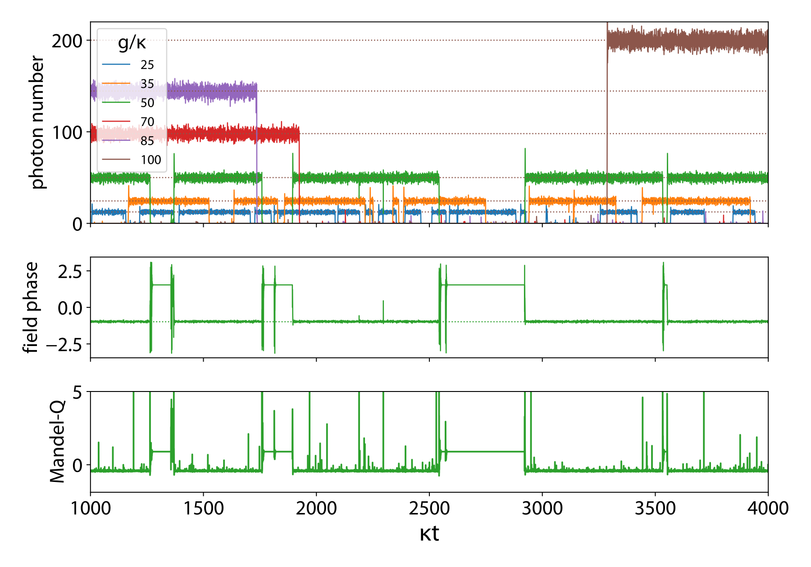

# C++QED v3

**A C++20 framework for high-performance simulation of open quantum dynamics**

C++QED is a framework for simulating open quantum systems — master equations and quantum-jump Monte Carlo (QJMC) trajectories — targeting production-scale runs on HPC/HTC clusters. It is the successor to C++QED v2, rewritten in a modern C++20 functional style while preserving the core performance principle: **compile-time resolution of the full tensor-product structure of the Hilbert space**.

📖 **[Developer Guide](https://vukics.github.io/cppqed/)** — narrative documentation, design rationale, and API reference.

---

## Who is this for?

C++QED occupies a different niche from QuTiP or QuantumOptics.jl:

| | QuTiP / QuantumOptics.jl | C++QED v3 |
|---|---|---|
| **Interface** | Interactive notebook / REPL | Compiled executable |
| **Workflow** | Prototype → explore → iterate | Define system → compile → deploy |
| **Execution** | Single workstation | Command-line, batch jobs, HPC/HTC clusters |
| **Parameter sweep** | Python/Julia loop | Cluster job array |
| **State** | In-memory, session-based | Checkpointed, resumable, serialized |
| **Output** | Inline plots | Structured, streamable data files |

If you are exploring a new system interactively, use QuTiP. If you are running thousands of trajectories in a parameter study on a cluster, C++QED is the right tool.

---

## Key features

- **Compile-time tensor product structure.** The `RANK` (number of subsystems) and the axes retained in any partial operation are non-type template parameters, resolved entirely at compile time. You pay the compilation cost once; every trajectory runs at full speed.
- **C++20 concepts and Boost.Hana sequences** replace the v2 template metaprogramming maze. Composite system Hamiltonians are heterogeneous Hana tuples; composition is recursive and zero-overhead.
- **Multi-diagonal sparse operators.** Virtually all physically relevant operators in quantum optics (ladder, number, Kerr, displacement, squeezing) are multi-diagonal in the Fock basis. `MultiDiagonal` is closed under composition, direct product, and Hermitian conjugation, with exact offset arithmetic.
- **Unified trajectory driver.** A single `run()` function handles checkpointing, automatic continuation, autostopping at steady state, adaptive output density, and structured JSON logging — everything needed for unattended HPC jobs.
- **QJMC ensemble parallelism.** The natural HTC model: submit N independent single-trajectory jobs; average in post-processing. `pcg64` provides provably independent parallel streams.
- **Master equation.** Lindblad master equation on full density operators, using the same `H/i` convention and non-Hermitian picture as QJMC — state-vector operations are broadcast directly over density operator indices.

---

## Library structure

The `MultiDiagonal` sparse operator library has been split into its own repository: **[cppqed-multidiagonal](https://github.com/vukics/cppqed-multidiagonal)**. It is a standalone, physics-agnostic C++ library for multi-diagonal sparse operators over tensor-product Hilbert spaces, and is a dependency of this repository.

```
cppqed-multidiagonal/           Standalone sparse operator library (separate repo)
  MultiDiagonal.h/.cc             Closed under composition, direct product, Hermitian conjugation

CPPQEDutils/                    Generic scaffolding
  MultiArray.h                    Strided N-dimensional array
  SliceIterator.h                 Compile-time axis slicing and partial trace
  ODE.h                           Adaptive ODE engine (Boost.Odeint / RKCK54)
  Trajectory.h                    run() driver: streaming, checkpointing, autostop
  StochasticTrajectory.h          Ensemble and stochastic trajectory concepts
  Pars.h                          Command-line / JSON parameter machinery

CPPQEDcore/
  quantumdata/                  LazyDensityOperator — lazy pure/mixed state
  quantumoperator/              MultiDiagonal integration and quantum operator algebra
  quantumtrajectory/            Master equation and QJMC integrators
  structure/                    Hamiltonian, Liouvillian, ExpectationValues
    → quantumdynamics

CPPQEDelements/
  Mode.{h,cc}                   Harmonic oscillator (Kerr, drive, decay)
  Qbit.{h,cc}                   Two-level system
  JaynesCummings.h              Cavity–atom coupling
  Composite.h                   Broadcaster: lifts subsystems to full tensor-product rank
```

---

## Examples

### Jaynes-Cummings QJMC

The canonical composite system: a two-level atom coupled to a driven, lossy cavity mode. This is the verified working example as of 2026-04.

```cpp
#include "Composite.h"
#include "JaynesCummings.h"
#include "Mode.h"
#include "Qbit.h"
#include "QuantumJumpMonteCarlo.h"
#include "Pars.h"
#include "pcg_random.hpp"

using namespace cppqedutils; using namespace quantumdata;
using namespace quantumtrajectory; using namespace structure;

int main(int argc, const char* argv[])
{
  auto op = optionParser();
  trajectory::Pars<qjmc::Pars<qjmc::Algorithm::integrating, pcg64>> pt{op};
  qbit::Pars pq{op, "q"};
  mode::Pars pm{op, "m"};
  double g;
  add(op, parameters::_("g", "Jaynes-Cummings coupling", 1., g));
  parse(op, argc, argv);

  StateVector<2> psi{ qbit::init(pq) * mode::init(pm) };

  Broadcaster<2,0> bQ{psi.extents};
  Broadcaster<2,1> bM{psi.extents};
  auto [cutoffQ, haQ, liQ, evQ, descrQ] = qbit::make(pq);
  auto [cutoffM, haM, liM, evM, descrM] = mode::make(pm);

  auto ha = hana::make_tuple(bQ(haQ), bM(haM),
                              jaynescummings::hamiltonian<0,1>(pm.cutoff, g));
  auto li = bQ(liQ);
  for (auto& l : bM(liM)) li.push_back(std::move(l));

  quantumtrajectory::run<qjmc::Algorithm::integrating, ODE_EngineBoost>(
    ha, li, hana::make_tuple(bQ(evQ), bM(evM)),
    json::object{{"system","Jaynes-Cummings"},{"qubit",descrQ},{"mode",descrM},{"g",g}},
    std::move(psi), pt, trajectory::observerNoOp);
}
```

Run it from bash as:

```bash
./jc_qjmc --T 500 --Dt 1 --o results/probe.out --kappaq 0.1 --kappam 0.1 --cutoffm 30 --g 5.0 --etam 10.
```


### Photon blockade breakdown (single driven Kerr mode)



The photon-blockade breakdown is a dissipative quantum phase transition of the strongly driven, strongly coupled Jaynes-Cummings model: as the drive amplitude increases, the cavity-atom system switches from a quantum (blockaded, low-photon-number) to a classical (unblocked, high-photon-number) regime. Finite-size scaling of this transition and its experimental observation have been studied with C++QED v2 simulations; the driven-dissipative Jaynes-Cummings model in v3 targets the same physics.

**Related publications:**
- Vukics et al., *Finite-size scaling of the photon-blockade breakdown dissipative quantum phase transition*, **Quantum** 3, 150 (2019). [DOI: 10.22331/q-2019-06-03-150](https://doi.org/10.22331/q-2019-06-03-150)
- Fink et al., *Observation of the Photon-Blockade Breakdown Phase Transition*, **Phys. Rev. X** 7, 011012 (2017). [DOI: 10.1103/PhysRevX.7.011012](https://doi.org/10.1103/PhysRevX.7.011012)
- Sett et al., *Emergent Macroscopic Bistability Induced by a Single Superconducting Qubit*, **PRX Quantum** 5, 010327 (2024). [DOI: 10.1103/PRXQuantum.5.010327](https://doi.org/10.1103/PRXQuantum.5.010327)

---

## Building

**Requirements:** C++20 compiler (GCC ≥ 12 or Clang ≥ 16), CMake ≥ 3.20, Boost (Odeint, Hana, Iostreams, JSON), Blitz++, [cppqed-multidiagonal](https://github.com/vukics/cppqed-multidiagonal).

```bash
git clone https://github.com/vukics/cppqed-multidiagonal.git
git clone https://github.com/vukics/cppqed.git
cd cppqed
cmake -B build -DCMAKE_BUILD_TYPE=Release
cmake --build build -j$(nproc)
```

On Windows, [WSL2](https://learn.microsoft.com/en-us/windows/wsl/) with Ubuntu 24.04 is the recommended environment.

---

## Papers

### C++QED v2 (predecessor)

The physics and algorithmic foundations of the framework are described in the v2 papers. v3 preserves the core methods while modernizing the implementation:

- A. Vukics, H. Ritsch, *C++QED: an object-oriented framework for wave-function simulations of cavity QED systems*, **Eur. Phys. J. D** 44, 585 (2007). [DOI: 10.1140/epjd/e2007-00210-x](https://doi.org/10.1140/epjd/e2007-00210-x)
- A. Vukics, *C++QEDv2: The multi-array concept and compile-time algorithms in the definition of composite quantum systems*, **Comput. Phys. Commun.** 183, 1381 (2012). [DOI: 10.1016/j.cpc.2012.01.004](https://doi.org/10.1016/j.cpc.2012.01.004)
- A. Vukics, T. Grießer, P. Domokos, *C++QEDv2 Milestone 10: A C++/Python application-programming framework for simulating open quantum dynamics*, **Comput. Phys. Commun.** 183, 1381 (2014). [DOI: 10.1016/j.cpc.2014.02.011](https://doi.org/10.1016/j.cpc.2014.02.011)
- M. Kornyik, A. Vukics, *The Monte Carlo wave-function method: A robust adaptive algorithm and a study in convergence*, **Comput. Phys. Commun.** 238, 88–101 (2019). [DOI: 10.1016/j.cpc.2018.12.015](https://doi.org/10.1016/j.cpc.2018.12.015)

- [An introductory talk](https://youtu.be/yunR73LNJ1M) given at GPU Day 2019

### C++QED v3 (in preparation)

Two papers are in preparation for *SciPost Physics Codebases*:

- **Paper 1 — [cppqed-multidiagonal](https://github.com/vukics/cppqed-multidiagonal)**: a standalone C++ library for multi-diagonal sparse operators over tensor-product Hilbert spaces; algebraically closed under composition, direct product, and Hermitian conjugation.
- **Paper 2 — C++QED v3**: the full framework; C++20 concepts + Boost.Hana replacing v2 TMP, with continuous interaction-picture reset, parallel-safe PRNG, and HPC/HTC production workflow.

---

## Status

C++QED v3 is under active development. The Jaynes-Cummings QJMC example compiles and runs correctly as of 2026-04. Known open items (exact propagators, `AutostopHandlerGeneric` with Hana tuple TDPs, signed-offset `MultiDiagonal` refactor) are tracked in the development primer.

---

## License

Distributed under the [Boost Software License, Version 1.0](LICENSE.txt).

## Authors

András Vukics — Wigner Research Centre for Physics, Budapest